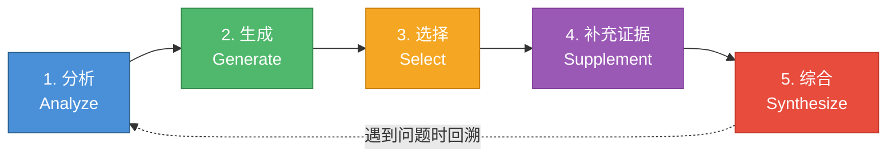
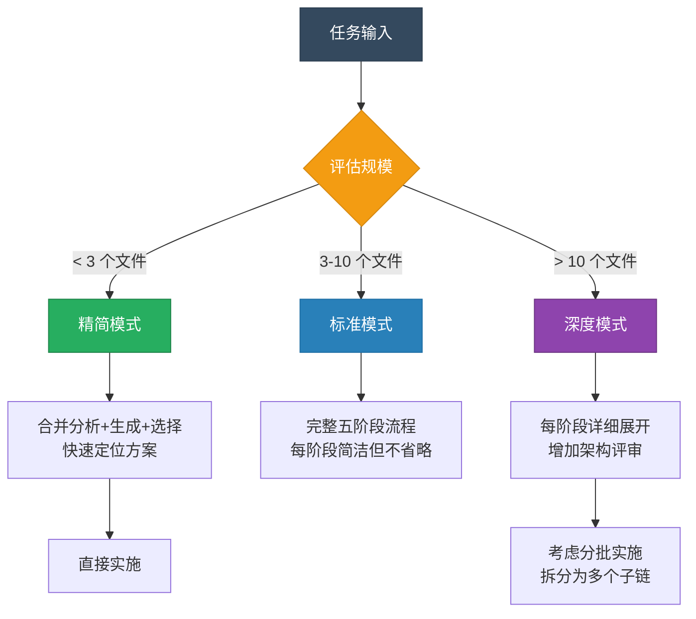

# PromptChain — 链式提示技能仓库

将复杂任务拆解为有序阶段，逐步精炼，获得高质量结果。

## 这是什么

PromptChain 是一套面向 AI 编程助手的**链式提示（Prompt Chaining）**技能定义。它提供一个五阶段工作流程，让 AI 在处理软件工程任务时能够：

- 先理解，再动手
- 多方案对比，择优执行
- 逐步实施，每步验证

## 五阶段流程



| 阶段 | 目标 |
|------|------|
| **分析（Analyze）** | 理解上下文，明确约束 |
| **生成（Generate）** | 产出 2-3 个可行方案 |
| **选择（Select）** | 对比维度评估，选出最优解 |
| **补充证据（Supplement）** | 细化实施细节和测试策略 |
| **综合（Synthesize）** | 逐步执行，验证结果 |

根据任务规模可灵活适配：



## 仓库结构

```
prompt-chaining/
├── SKILL.md                        # 核心技能定义
│   ├── 触发条件
│   ├── 五阶段链式流程
│   ├── 任务规模适配
│   └── 常见反模式
└── references/
    ├── chain-templates.md          # 5 种场景链式模板
    └── ide-integration.md          # AI IDE 集成指南
```

## 链式模板

提供 5 种常见场景的即用模板：

| 模板 | 适用场景 |
|------|---------|
| 新功能开发 | 从零实现新功能或新模块 |
| Bug 修复 | 定位并修复已知 Bug |
| 代码重构 | 改善代码结构，不改变行为 |
| 项目脚手架 | 初始化新项目的基础结构 |
| 文档创作 | 编写技术文档和使用指南 |

详见 [`references/chain-templates.md`](prompt-chaining/references/chain-templates.md)

## IDE 集成

支持主流 AI IDE，一行配置即可启用：

| IDE | 配置文件 |
|-----|---------|
| Claude Code | `CLAUDE.md` |
| Cursor | `.cursorrules` |
| Windsurf | `.windsurfrules` |

还提供了"两次对话"模式和长会话管理等通用策略。

详见 [`references/ide-integration.md`](prompt-chaining/references/ide-integration.md)

## 典型提示示例

以下提示可以唤醒链式流程，让 AI 自动进入分阶段思考模式：

### 新功能开发

```
帮我给用户模块添加 OAuth2 第三方登录功能，支持 Google 和 GitHub。
```

```
我需要实现一个文件上传服务，支持分片上传和断点续传，请先分析再动手。
```

### Bug 修复

```
用户反馈登录后偶尔会被踢出，session 好像没有正确续期，帮我排查并修复。
```

```
这个接口在并发请求时偶尔返回 500，日志显示数据库死锁，请定位根因。
```

### 代码重构

```
src/services/order.ts 已经超过 800 行了，帮我拆分重构，不要改变外部行为。
```

```
项目里有大量重复的表单验证逻辑，帮我提取公共方法并统一。
```

### 项目脚手架

```
帮我初始化一个 Next.js + TypeScript 的项目，需要 ESLint、Prettier、Jest 和 Husky。
```

### 文档创作

```
帮我为这个 SDK 写一份 API 参考文档，目标读者是第三方开发者。
```

### 通用触发句式

当你希望显式激活链式流程时，可以在提示中加入以下关键句式：

| 句式 | 效果 |
|------|------|
| `请先分析再动手` | 强制进入分析阶段，避免跳过思考 |
| `给我 2-3 个方案对比` | 触发生成+选择阶段 |
| `先不要写代码，只做规划` | 仅执行分析→生成→选择，暂停在补充证据阶段 |
| `逐步实施，每步告诉我结果` | 在综合阶段保持人机交互 |
| `这个任务比较复杂，请用链式流程` | 直接指定使用完整五阶段流程 |

## 快速开始

1. 将 `prompt-chaining/SKILL.md` 的核心流程嵌入你的 AI IDE 配置文件
2. 根据需要选用 `references/chain-templates.md` 中的场景模板
3. 参考 `references/ide-integration.md` 完成 IDE 集成

## 核心原则

1. **逐步精炼优于一步到位** — 分阶段处理让每一步更可控
2. **显式推理优于隐式假设** — 把思考过程外化，减少遗漏
3. **多方案对比优于单一路径** — 比较才能发现优劣
4. **上下文感知优于模板套用** — 尊重每个项目的约定
5. **灵活适配优于僵化执行** — 流程为人服务

## 许可

MIT
