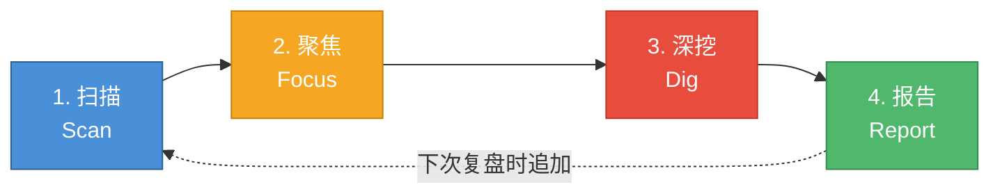

# PromptChain — AI 技能仓库

面向 AI 编程助手的技能（Skill）集合，让 AI 在对话中自动遵循结构化的工作流程。

## 这是什么

PromptChain 是一个 **AI Skill 仓库**，收录多个可独立使用的技能定义。每个 Skill 定义了一套完整的交互流程，让 AI 编程助手在特定场景下表现得更专业、更可控。

### 已收录的 Skill

| Skill | 用途 | 核心流程 |
|-------|------|---------|
| **[Prompt Chaining](prompt-chaining/SKILL.md)** | 将复杂编程任务拆解为有序阶段 | 分析 → 生成 → 选择 → 补充 → 综合 |
| **[DrawIt](draw-it/SKILL.md)** | 交互式概念可视化，将想法变成图 | 理解意图 → 选择方案 → 绘制迭代 |
| **[LessonLearn](lesson-learn/SKILL.md)** | 项目经验复盘，生成学习报告 | 扫描 → 聚焦 → 深挖 → 报告 |

---

## Skill 1: Prompt Chaining — 链式提示

将复杂任务拆解为有序阶段，逐步精炼，获得高质量结果。让 AI 在处理软件工程任务时能够：

- 先理解，再动手
- 多方案对比，择优执行
- 逐步实施，每步验证

## 五阶段流程


| 阶段 | 目标 |
|------|------|
| **分析（Analyze）** | 理解上下文，明确约束 |
| **生成（Generate）** | 产出 2-3 个可行方案 |
| **选择（Select）** | 对比维度评估，选出最优解 |
| **补充证据（Supplement）** | 细化实施细节和测试策略 |
| **综合（Synthesize）** | 逐步执行，验证结果 |

根据任务规模可灵活适配：


## 仓库结构

```
├── prompt-chaining/                    # Skill 1: 链式提示
│   ├── SKILL.md                        # 核心技能定义
│   │   ├── 触发条件
│   │   ├── 五阶段链式流程
│   │   ├── 任务规模适配
│   │   └── 常见反模式
│   └── references/
│       ├── chain-templates.md          # 5 种场景链式模板
│       └── ide-integration.md          # AI IDE 集成指南
│
├── draw-it/                            # Skill 2: 概念可视化
│   ├── SKILL.md                        # 核心技能定义
│   │   ├── 触发条件
│   │   ├── 三阶段交互流程
│   │   ├── 工具选择决策树
│   │   └── 常见反模式
│   └── references/
│       ├── drawing-templates.md        # 10 种绘图模板
│       └── tool-guide.md              # 四种工具详细指南
│
└── lesson-learn/                       # Skill 3: 项目经验复盘
    ├── SKILL.md                        # 核心技能定义
    │   ├── 触发条件
    │   ├── 四阶段复盘流程
    │   ├── 分析维度详解
    │   └── 常见反模式
    └── references/
        ├── report-template.md          # 报告模板与示例
        └── analysis-guide.md           # 分析维度指南
```

## 链式模板

提供 5 种常见场景的即用模板：

| 模板 | 适用场景 |
|------|---------|
| 新功能开发 | 从零实现新功能或新模块 |
| Bug 修复 | 定位并修复已知 Bug |
| 代码重构 | 改善代码结构，不改变行为 |
| 项目脚手架 | 初始化新项目的基础结构 |
| 文档创作 | 编写技术文档和使用指南 |

详见 [`references/chain-templates.md`](prompt-chaining/references/chain-templates.md)

## IDE 集成

支持主流 AI IDE，一行配置即可启用：

| IDE | 配置文件 |
|-----|---------|
| Claude Code | `CLAUDE.md` |
| Cursor | `.cursorrules` |
| Windsurf | `.windsurfrules` |

还提供了"两次对话"模式和长会话管理等通用策略。

详见 [`references/ide-integration.md`](prompt-chaining/references/ide-integration.md)

## 典型提示示例

以下提示可以唤醒链式流程，让 AI 自动进入分阶段思考模式：

### 新功能开发

```
帮我给用户模块添加 OAuth2 第三方登录功能，支持 Google 和 GitHub。
```

```
我需要实现一个文件上传服务，支持分片上传和断点续传，请先分析再动手。
```

### Bug 修复

```
用户反馈登录后偶尔会被踢出，session 好像没有正确续期，帮我排查并修复。
```

```
这个接口在并发请求时偶尔返回 500，日志显示数据库死锁，请定位根因。
```

### 代码重构

```
src/services/order.ts 已经超过 800 行了，帮我拆分重构，不要改变外部行为。
```

```
项目里有大量重复的表单验证逻辑，帮我提取公共方法并统一。
```

### 项目脚手架

```
帮我初始化一个 Next.js + TypeScript 的项目，需要 ESLint、Prettier、Jest 和 Husky。
```

### 文档创作

```
帮我为这个 SDK 写一份 API 参考文档，目标读者是第三方开发者。
```

### 通用触发句式

当你希望显式激活链式流程时，可以在提示中加入以下关键句式：

| 句式 | 效果 |
|------|------|
| `请先分析再动手` | 强制进入分析阶段，避免跳过思考 |
| `给我 2-3 个方案对比` | 触发生成+选择阶段 |
| `先不要写代码，只做规划` | 仅执行分析→生成→选择，暂停在补充证据阶段 |
| `逐步实施，每步告诉我结果` | 在综合阶段保持人机交互 |
| `这个任务比较复杂，请用链式流程` | 直接指定使用完整五阶段流程 |

---

## Skill 2: DrawIt — 概念可视化

通过交互式对话，将抽象概念变成直观的图形。


### 支持的工具

| 工具 | 最佳场景 |
|------|---------|
| **Mermaid** | 流程图、时序图、类图、ER 图、甘特图等结构化图表 |
| **SVG** | 自定义图形、图标、信息图、需要精确控制的视觉元素 |
| **HTML** | 交互式图表、仪表盘、带动画的可视化 |
| **Excalidraw** | 手绘风格白板图、头脑风暴、草图 |

### 绘图模板

提供 10 种即用模板：

| 模板 | 适用场景 |
|------|---------|
| 系统架构图 | 组件关系、微服务拓扑、分层架构 |
| 业务流程图 | 操作步骤、审批流程、工作流 |
| 时序图 | API 调用链、微服务通信 |
| ER 图 | 数据库设计、数据建模 |
| 状态机 | 对象生命周期、状态转换 |
| 甘特图 | 项目排期、迭代计划 |
| 思维导图 | 知识梳理、头脑风暴 |
| 对比图 | 方案对比、技术选型 |
| 时间线 | 版本演进、里程碑 |
| 象限图 | 优先级矩阵、二维评估 |

详见 [`references/drawing-templates.md`](draw-it/references/drawing-templates.md)

### 典型提示示例

```
帮我画一张系统架构图，展示前端、API 网关和后端微服务之间的关系。
```

```
我想用时序图展示用户登录的完整流程，包括 OAuth2 的授权码交换过程。
```

```
把这个状态机画出来：订单从创建到完成有哪些状态转换。用 Mermaid。
```

```
帮我可视化这三个方案的优劣对比，做成一个好看的表格，用 HTML。
```

```
用 Excalidraw 画个草图，展示我们的数据处理管道。
```

### 通用触发句式

| 句式 | 效果 |
|------|------|
| `帮我画一张...图` | 直接触发 DrawIt，AI 会确认内容后开始绘制 |
| `帮我可视化...` | 触发 DrawIt，AI 会分析最合适的图形表达 |
| `用 Mermaid/SVG/HTML 画` | 指定工具，跳过工具选择阶段 |
| `画个草图/示意图` | 倾向使用 Excalidraw 手绘风格 |
| `做成交互式的` | 倾向使用 HTML 实现 |

---

## Skill 3: LessonLearn — 项目经验复盘

从当前项目中提炼经验教训，生成结构化的学习报告，指导后续开发。



### 核心特点

| 特点 | 说明 |
|------|------|
| **AI 自适应聚焦** | 根据项目特征自动选择最值得分析的 2-3 个维度 |
| **深度优先** | 不做泛泛扫描，每条教训都具体到文件、到模式、到行动 |
| **增量积累** | 报告支持追加，随项目演进持续沉淀经验 |
| **面向行动** | 每条建议都具体可操作，直接指导后续开发 |

### 分析维度

AI 根据项目信号自动选择，包括但不限于：

| 维度 | 关注点 |
|------|--------|
| 代码质量 | 重复代码、文件过长、命名规范、复杂度 |
| 架构决策 | 模块边界、技术选型、数据流、可扩展性 |
| Git 历史 | 热点文件、revert 记录、提交模式 |
| 依赖管理 | 过时依赖、安全漏洞、依赖数量 |
| 工程实践 | 测试策略、CI/CD、开发体验 |

### 典型提示示例

```
帮我复盘一下这个项目，总结经验教训。
```

```
这个项目开发到现在，有哪些值得记录的经验和教训？生成一份学习报告。
```

```
项目 v2.0 刚上线，帮我做一次阶段性总结。
```

### 通用触发句式

| 句式 | 效果 |
|------|------|
| `帮我复盘/总结经验` | 触发完整的四阶段复盘流程 |
| `生成学习报告` | 直接生成报告文件 |
| `重点看看架构/测试/依赖` | 指定分析维度，跳过 AI 自动选择 |
| `追加一次复盘` | 在已有报告基础上增量追加 |

详见 [`references/report-template.md`](lesson-learn/references/report-template.md) 和 [`references/analysis-guide.md`](lesson-learn/references/analysis-guide.md)

---

## 快速开始

### Prompt Chaining

1. 将 `prompt-chaining/SKILL.md` 的核心流程嵌入你的 AI IDE 配置文件
2. 根据需要选用 `references/chain-templates.md` 中的场景模板
3. 参考 `references/ide-integration.md` 完成 IDE 集成

### DrawIt

1. 将 `draw-it/SKILL.md` 的核心流程嵌入你的 AI IDE 配置文件
2. 使用 `references/drawing-templates.md` 中的模板作为绘图起点
3. 参考 `references/tool-guide.md` 了解各工具的能力和最佳实践

### LessonLearn

1. 将 `lesson-learn/SKILL.md` 的核心流程嵌入你的 AI IDE 配置文件
2. 在项目开发过程中随时要求 AI 进行复盘
3. 参考 `references/report-template.md` 了解报告格式和示例
4. 参考 `references/analysis-guide.md` 了解各分析维度的检查点

## 核心原则

1. **逐步精炼优于一步到位** — 分阶段处理让每一步更可控
2. **显式推理优于隐式假设** — 把思考过程外化，减少遗漏
3. **多方案对比优于单一路径** — 比较才能发现优劣
4. **上下文感知优于模板套用** — 尊重每个项目的约定
5. **灵活适配优于僵化执行** — 流程为人服务

## 许可

MIT
