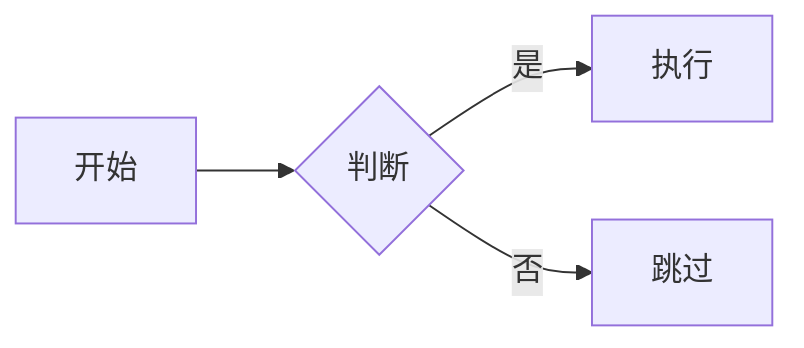

# DrawIt — 概念可视化技能

## 概述

DrawIt 是一个交互式概念可视化技能。它帮助用户将抽象的概念、流程、架构、关系等信息转化为直观的图形表达。

核心特点：
- **交互式引导**：通过对话理解用户想表达的内容，而不是让用户自己描述图的结构
- **多工具支持**：Mermaid、SVG、HTML、Excalidraw，按场景选择最合适的工具
- **样式可选**：用户可以指定图表类型和视觉风格

---

## 触发条件

当遇到以下情况时，应自动激活 DrawIt 技能：

- 用户要求"画一个图"、"帮我可视化"、"做个示意图"
- 用户描述了一个复杂概念，用图形比文字更容易理解
- 讨论架构、流程、关系、对比等天然适合图形表达的主题
- 用户提到 Mermaid、SVG、Excalidraw 等绘图关键词

**不需要激活的场景：**

- 用户只需要文字解释
- 已有现成的图，用户只是在讨论它
- 纯代码层面的问题（如"这个函数怎么写"）

---

## 支持的工具与适用场景

| 工具 | 最佳场景 | 输出形式 |
|------|---------|---------|
| **Mermaid** | 流程图、时序图、类图、ER 图、甘特图等结构化图表 | Markdown 代码块 |
| **SVG** | 自定义图形、图标、示意图、需要精确控制的视觉元素 | `.svg` 文件或内联代码 |
| **HTML** | 交互式图表、仪表盘、带动画的可视化、复杂布局 | `.html` 文件 |
| **Excalidraw** | 手绘风格的白板图、头脑风暴、草图、自由布局 | 通过 Excalidraw MCP 工具 |

### 工具选择决策树

```
用户想画什么？
│
├─ 结构化图表（流程、时序、类关系、ER）
│  └─ → Mermaid（首选，简洁且版本可控）
│
├─ 精确控制的图形（图标、Logo、示意图、信息图）
│  └─ → SVG（像素级控制，可缩放）
│
├─ 交互式/动态内容（可点击、有动画、仪表盘）
│  └─ → HTML（CSS + JS 实现交互）
│
├─ 手绘风格/自由发挥（白板、草图、头脑风暴）
│  └─ → Excalidraw（手绘质感，自由拖拽）
│
└─ 不确定
   └─ → 向用户展示选项，引导选择
```

---

## 三阶段交互流程

### 第一阶段：理解意图（Understand）

**目标：** 弄清楚用户到底想可视化什么。

**操作：**
1. 从用户的描述中提取核心概念和关系
2. 判断信息是否充分，不充分则提问澄清
3. 识别图形的目标受众和使用场景

**关键提问（按需）：**
- 这张图是给谁看的？（技术团队 / 非技术人员 / 自己梳理思路）
- 你想强调什么？（流程顺序 / 层级关系 / 数据对比 / 时间线）
- 有没有偏好的风格？（专业正式 / 简洁清爽 / 手绘草图）

**输出：** 对图形内容的结构化理解：
- 图形主题
- 包含的元素和关系
- 强调重点

### 第二阶段：选择方案（Choose）

**目标：** 确定用工具和图表样式。

**操作：**
1. 根据内容特点推荐最合适的工具
2. 在该工具下推荐具体的图表类型/样式
3. 向用户呈现选项，让用户做最终决定

**呈现方式：**

向用户展示 2-3 个选项，每个选项说明：
- 工具 + 图表类型
- 为什么适合
- 效果预期

例如：
```
你描述的是一个多服务之间的调用关系，我建议：

1. Mermaid 时序图 — 清晰展示调用顺序和响应关系，适合放在文档中
2. Mermaid 流程图 — 展示整体拓扑，适合看全局
3. Excalidraw 白板图 — 自由布局，适合讨论和头脑风暴

你想用哪种？
```

**输出：** 用户确认的工具 + 图表类型 + 风格。

### 第三阶段：绘制与迭代（Draw & Refine）

**目标：** 产出图形，并根据反馈迭代。

**操作：**
1. 根据选定方案生成图形代码
2. 呈现给用户查看
3. 收集反馈，快速迭代修改

**迭代原则：**
- 先出一版"能看"的，再根据反馈调细节
- 每次修改聚焦用户提出的具体问题
- 不要一次性改太多，保持增量可控

**输出：** 最终的图形代码/文件。

---

## Mermaid 图表类型速查

| 类型 | 关键词 | 适用场景 |
|------|--------|---------|
| `flowchart` | 流程、步骤、决策 | 业务流程、算法逻辑、决策树 |
| `sequenceDiagram` | 调用、交互、消息 | API 调用链、微服务通信、协议交互 |
| `classDiagram` | 类、继承、接口 | OOP 设计、领域模型 |
| `erDiagram` | 实体、关系、字段 | 数据库设计、数据建模 |
| `gantt` | 时间线、排期、阶段 | 项目计划、迭代规划 |
| `stateDiagram-v2` | 状态、转换、事件 | 状态机、生命周期 |
| `pie` | 占比、分布 | 数据分布、份额占比 |
| `gitGraph` | 分支、合并、提交 | Git 工作流、版本策略 |
| `mindmap` | 层级、发散、关联 | 头脑风暴、知识结构 |
| `timeline` | 时间、事件、里程碑 | 历史沿革、版本演进 |
| `quadrantChart` | 两维评估、优先级 | 技术选型、任务优先级 |
| `block-beta` | 系统组件、架构层 | 系统架构、部署拓扑 |
| `sankey-beta` | 流量、转化、分配 | 流量分析、资源分配 |
| `xychart-beta` | 数据点、趋势 | 性能趋势、统计对比 |
| `packet-beta` | 协议结构、字段布局 | 网络协议、数据帧 |

---

## 任务规模适配

### 单图（简单概念）

- 直接进入第三阶段，快速出图
- 工具选择可以由 AI 默认推荐，用户确认即可
- 例如："画个简单的流程图，A → B → C"

### 多图（复杂系统）

- 完整执行三阶段
- 可能需要多张图从不同角度表达同一系统
- 例如：一张架构图 + 一张时序图 + 一张 ER 图

### 系列图（文档配图）

- 需要统一风格和配色
- 先确定整体视觉规范，再逐张绘制
- 例如：为一篇技术博客配 5 张插图

---

## 各工具产出规范

### Mermaid

输出为 Markdown 代码块，方便嵌入文档：

````

````

**注意事项：**
- 节点文本避免特殊字符，必要时用引号包裹
- 复杂图表控制在 30 个节点以内，超出则拆分
- 善用 `subgraph` 分组，提升可读性
- 用 `style` 和 `classDef` 添加颜色区分

### SVG

输出为独立 `.svg` 文件或代码块：

```svg
<svg xmlns="http://www.w3.org/2000/svg" viewBox="0 0 400 300">
  <rect x="10" y="10" width="180" height="80" rx="8"
        fill="#4a90d9" stroke="#2c5f8a" stroke-width="2"/>
  <text x="100" y="55" text-anchor="middle"
        fill="white" font-family="sans-serif" font-size="16">
    组件 A
  </text>
</svg>
```

**注意事项：**
- 始终设置 `viewBox`，确保可缩放
- 使用语义化的 `<g>` 分组
- 颜色使用一致的配色方案
- 中文字体指定 `font-family="sans-serif"` 确保兼容性

### HTML

输出为可直接打开的独立 `.html` 文件：

```html
<!DOCTYPE html>
<html lang="zh-CN">
<head>
  <meta charset="UTF-8">
  <style>/* 内联样式 */</style>
</head>
<body>
  <!-- 图形内容 -->
  <script>/* 交互逻辑（如需要）*/</script>
</body>
</html>
```

**注意事项：**
- CSS 和 JS 全部内联，确保单文件可运行
- 不依赖外部 CDN（除非用户明确要求）
- 响应式设计，适配不同屏幕尺寸
- 如需图表库，优先使用轻量方案

### Excalidraw

通过 Excalidraw MCP 工具调用：

- 利用 MCP 提供的 API 创建和操作画布
- 支持的元素类型：矩形、椭圆、菱形、箭头、文本、线条
- 手绘风格自动应用，无需额外配置
- 适合需要后续手动调整的场景

**注意事项：**
- 元素布局需要计算合理的坐标和间距
- 箭头连接需指定起止元素
- 文本长度影响元素尺寸，需要预估
- 分组(group) 用于逻辑相关的元素集合

---

## 配色方案参考

### 专业风格

```
主色：#4a90d9（蓝）
辅色：#50b86c（绿）、#f5a623（橙）、#9b59b6（紫）
背景：#ffffff
文字：#2c3e50
边框：比填充色深 20%
```

### 简洁风格

```
主色：#333333
辅色：#666666、#999999
强调：#e74c3c（红）
背景：#ffffff
线条：#cccccc
```

### 暗色风格

```
主色：#61dafb
辅色：#a78bfa、#34d399、#fbbf24
背景：#1a1a2e
文字：#e0e0e0
边框：#404060
```

---

## 常见反模式

### 1. 不问就画

**表现：** 用户说"帮我画个架构图"，直接开始画，没有问清楚画什么。

**后果：** 画出来的东西不是用户想要的，浪费时间。

**纠正：** 至少确认三件事 — 画什么内容、给谁看、用什么工具。

### 2. 信息过载

**表现：** 把所有细节都塞进一张图里。

**后果：** 图变得密密麻麻，比不画还难理解。

**纠正：** 一张图只表达一个核心观点。需要多个角度就画多张图。

### 3. 工具错配

**表现：** 用 Mermaid 画自由布局的草图，或用 SVG 画流程图。

**后果：** 事倍功半，代码复杂但效果差。

**纠正：** 遵循工具选择决策树，用对的工具做对的事。

### 4. 忽视迭代

**表现：** 花大量时间追求一次性完美产出。

**后果：** 方向可能一开始就偏了，做得越精细浪费越多。

**纠正：** 先出草稿，让用户确认方向，再精修细节。

### 5. 样式不一致

**表现：** 同一组图使用了不同的配色、字体、线条风格。

**后果：** 看起来不像出自同一人之手，不专业。

**纠正：** 在开始绘制前先确定配色方案，多图共享同一套视觉规范。

---

## 核心原则

1. **图是为了沟通，不是为了好看** — 清晰传达信息是第一目标
2. **少即是多** — 一张图一个重点，留白和省略也是设计
3. **先粗后细** — 快速出草稿，迭代到满意
4. **工具服务于内容** — 先想清楚画什么，再选用什么画
5. **交互优于猜测** — 不确定时问用户，而不是自己假设
