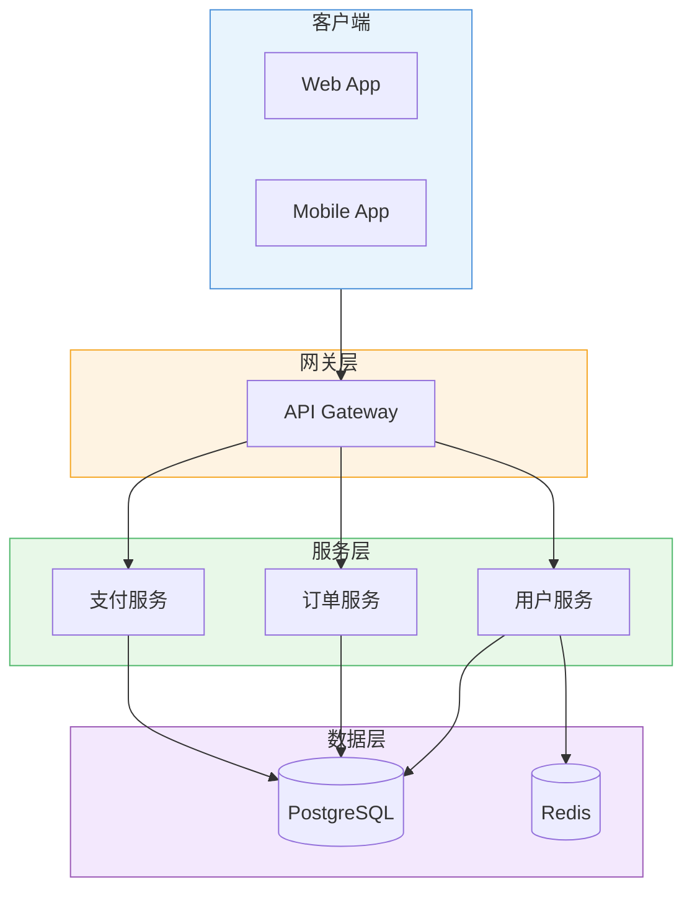
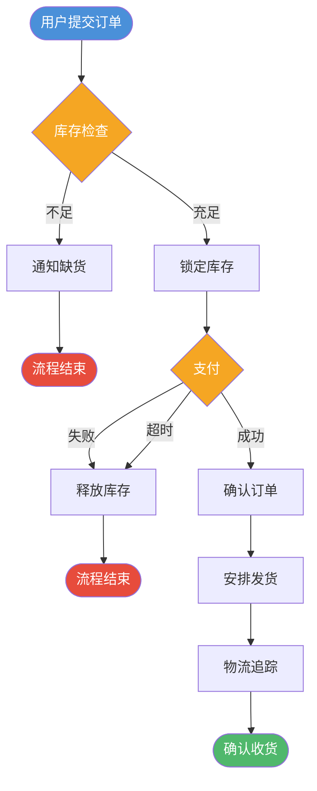
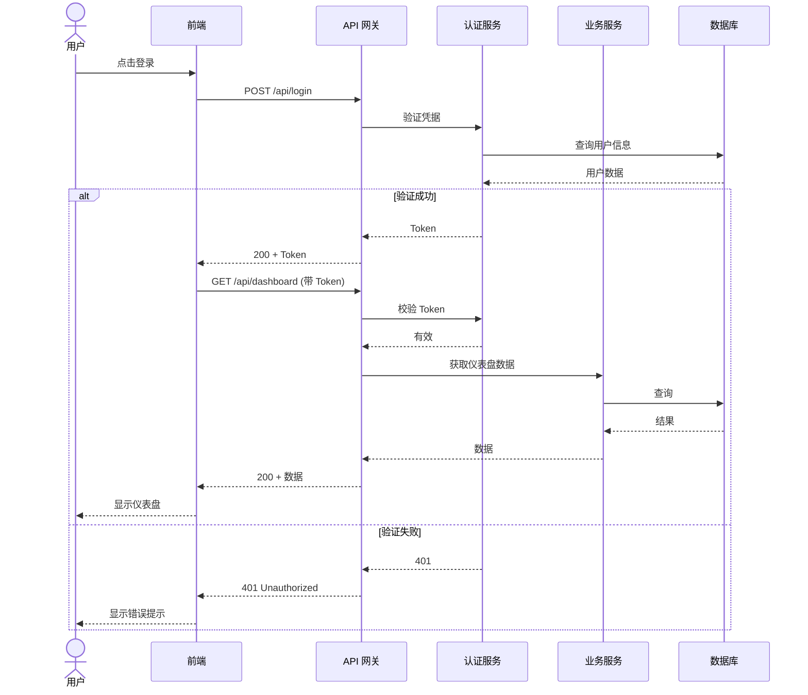
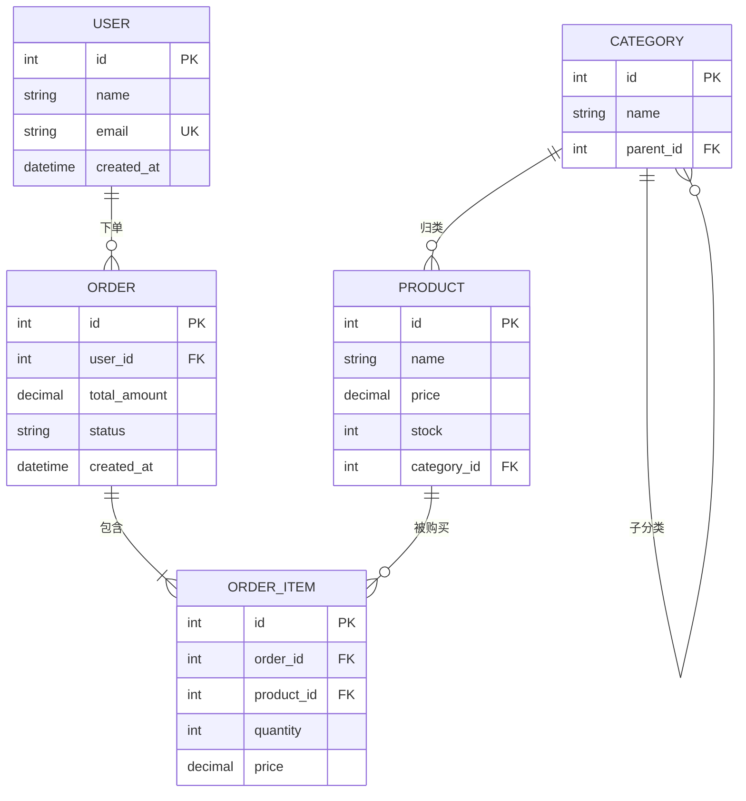
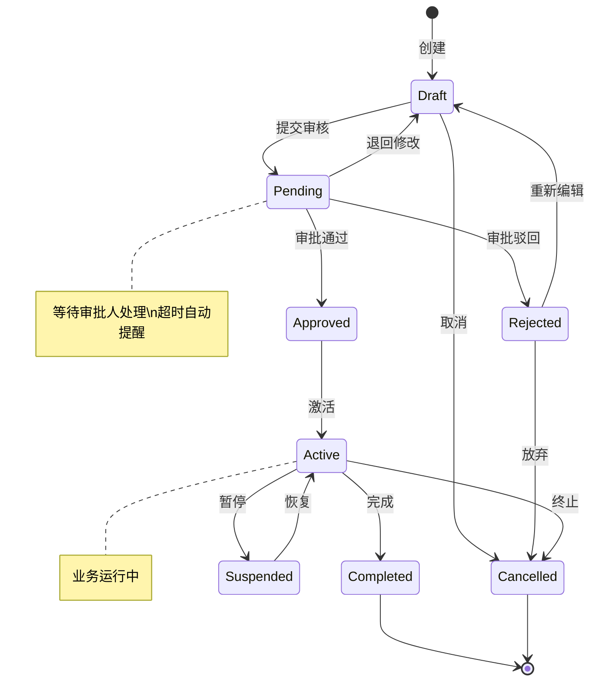
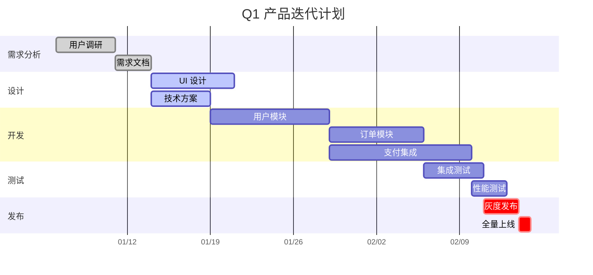
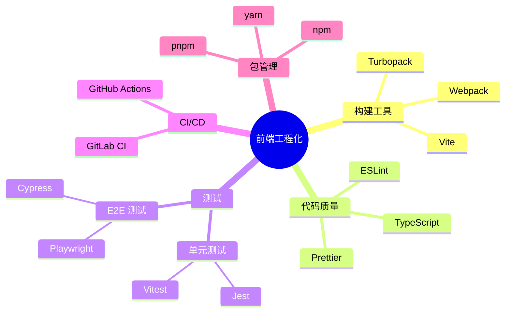
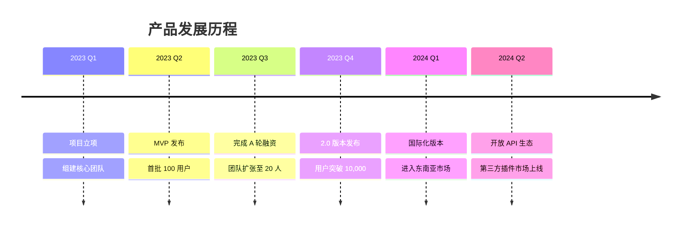
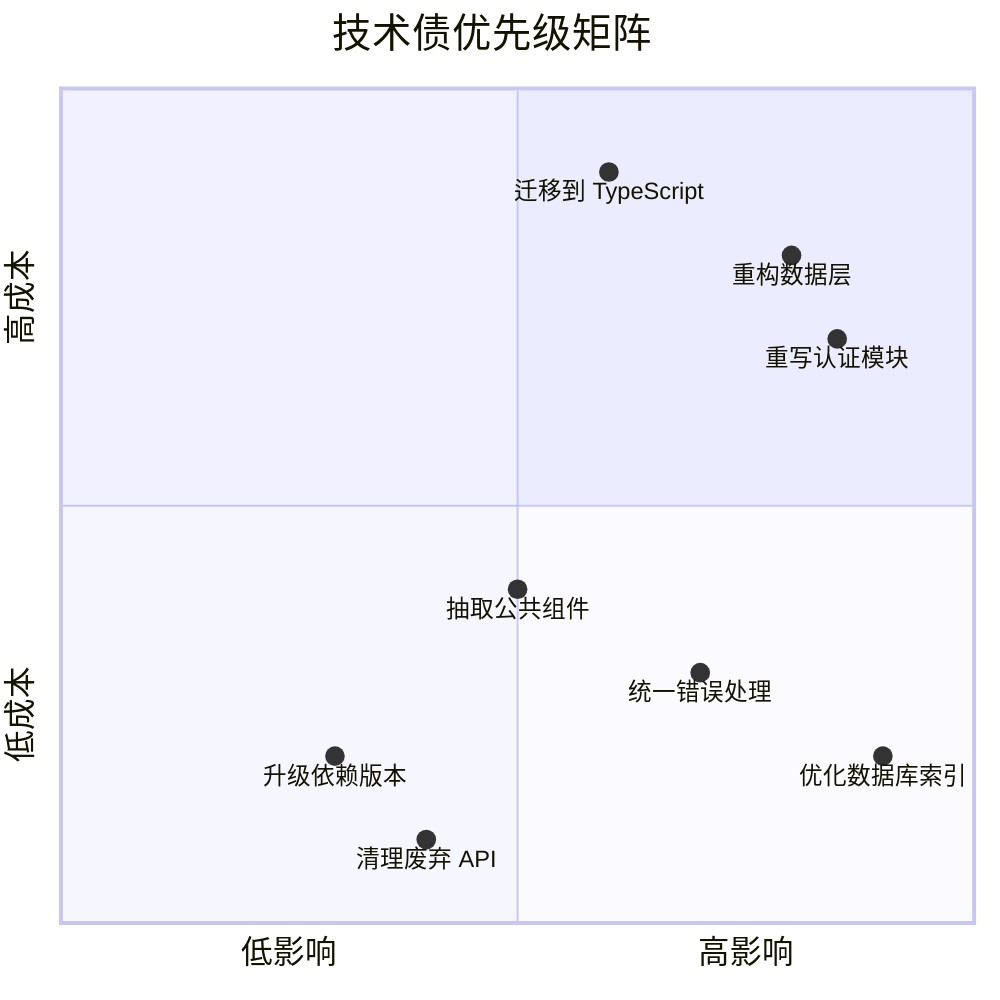

# 绘图模板集合

本文档提供常见可视化场景的即用模板。每个模板包含 Mermaid 和 SVG 两种实现，方便按需选用。

---

## 模板一：系统架构图

**适用场景：** 展示系统组件及其关系，如微服务架构、前后端分层、部署拓扑。

### Mermaid 实现

```mermaid
block-beta
  columns 3

  space:3

  subgraph "客户端层"
    Web["Web App"]
    Mobile["Mobile App"]
    CLI["CLI Tool"]
  end

  space:3

  subgraph "API 网关层"
    Gateway["API Gateway\nNginx / Kong"]
  end

  space:3

  subgraph "服务层"
    UserSvc["用户服务"]
    OrderSvc["订单服务"]
    PaySvc["支付服务"]
  end

  space:3

  subgraph "数据层"
    DB[("PostgreSQL")]
    Cache[("Redis")]
    MQ[["Kafka"]]
  end

  Web --> Gateway
  Mobile --> Gateway
  CLI --> Gateway
  Gateway --> UserSvc
  Gateway --> OrderSvc
  Gateway --> PaySvc
  UserSvc --> DB
  UserSvc --> Cache
  OrderSvc --> DB
  OrderSvc --> MQ
  PaySvc --> DB
```

### 替代：Mermaid flowchart 实现



---

## 模板二：业务流程图

**适用场景：** 展示业务操作步骤、审批流程、工作流。

### Mermaid 实现



---

## 模板三：时序图（API 调用链）

**适用场景：** 展示多个参与者之间的消息传递顺序，如 API 调用链、微服务通信。

### Mermaid 实现



---

## 模板四：数据模型（ER 图）

**适用场景：** 展示数据库表结构和表间关系。

### Mermaid 实现



---

## 模板五：状态机

**适用场景：** 展示对象的生命周期状态转换。

### Mermaid 实现



---

## 模板六：甘特图（项目排期）

**适用场景：** 展示项目时间线、任务排期、迭代计划。

### Mermaid 实现



---

## 模板七：思维导图

**适用场景：** 知识梳理、头脑风暴、层级概念展示。

### Mermaid 实现



---

## 模板八：对比图

**适用场景：** 两个或多个方案/技术的多维度对比。

### HTML 实现

```html
<!DOCTYPE html>
<html lang="zh-CN">
<head>
<meta charset="UTF-8">
<style>
  body { font-family: -apple-system, sans-serif; padding: 2rem; background: #f8f9fa; }
  .table-wrapper { overflow-x: auto; }
  table { border-collapse: collapse; width: 100%; background: white; border-radius: 8px; overflow: hidden; box-shadow: 0 1px 3px rgba(0,0,0,0.1); }
  th, td { padding: 12px 16px; text-align: left; border-bottom: 1px solid #eee; }
  th { background: #2c3e50; color: white; font-weight: 600; }
  th:first-child { background: #34495e; }
  tr:hover { background: #f5f8ff; }
  .good { color: #27ae60; font-weight: 600; }
  .mid { color: #f39c12; font-weight: 600; }
  .bad { color: #e74c3c; font-weight: 600; }
</style>
</head>
<body>
  <div class="table-wrapper">
    <table>
      <tr>
        <th>维度</th><th>方案 A</th><th>方案 B</th><th>方案 C</th>
      </tr>
      <tr>
        <td><strong>性能</strong></td>
        <td class="good">优秀</td>
        <td class="mid">一般</td>
        <td class="good">优秀</td>
      </tr>
      <tr>
        <td><strong>易用性</strong></td>
        <td class="mid">中等</td>
        <td class="good">简单</td>
        <td class="bad">复杂</td>
      </tr>
      <tr>
        <td><strong>维护成本</strong></td>
        <td class="good">低</td>
        <td class="good">低</td>
        <td class="bad">高</td>
      </tr>
    </table>
  </div>
</body>
</html>
```

---

## 模板九：时间线

**适用场景：** 版本演进、历史事件、里程碑。

### Mermaid 实现



---

## 模板十：象限图（优先级矩阵）

**适用场景：** 二维评估、优先级排序、技术选型。

### Mermaid 实现



---

## 使用建议

1. **直接复制修改**：这些模板可以直接复制，替换为你的实际内容
2. **混合使用**：同一个项目可能需要多种图表类型，按需组合
3. **保持简洁**：模板展示了较完整的结构，实际使用时可以按需精简
4. **样式统一**：如果在同一文档中使用多张图，保持配色和风格一致
