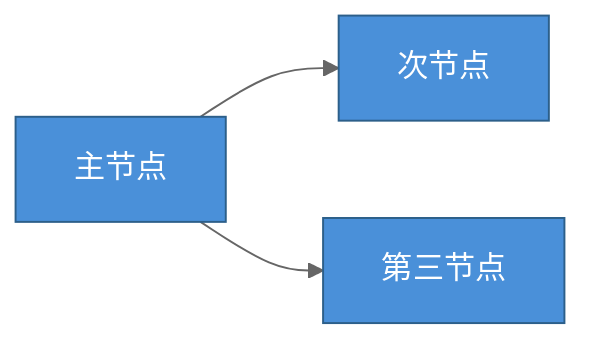
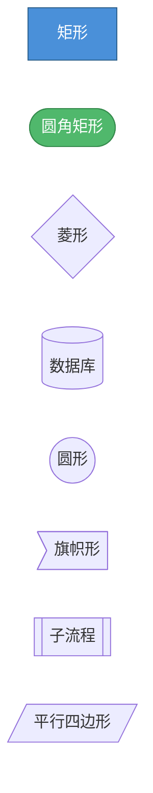
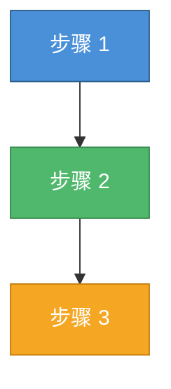

# 绘图工具详细指南

本文档详细介绍 DrawIt 支持的四种绘图工具的能力边界、最佳实践和常见陷阱。

---

## Mermaid

### 简介

Mermaid 是一种基于文本的图表描述语言，通过代码生成图形。它的最大优势是**版本可控**——图表以文本形式存在，可以 diff、review、合并。

### 能力边界

**擅长：**
- 结构化的图表（有明确的节点和关系）
- 嵌入 Markdown 文档
- 自动布局（不需要手动指定坐标）
- 团队协作（文本易于 review）

**不擅长：**
- 自由形式的手绘/草图
- 精确的位置控制（布局引擎自动决定）
- 复杂的自定义样式
- 图片/图标嵌入

### 样式定制

#### 主题

Mermaid 内置主题，可通过 `%%{init:}%%` 配置：



可用的内置主题：`default`、`dark`、`forest`、`neutral`、`base`

#### 节点样式



#### classDef 批量样式



### 常见陷阱

| 陷阱 | 说明 | 解法 |
|------|------|------|
| 特殊字符 | 节点文本含 `()[]{}` 等字符会破坏语法 | 用引号包裹：`A["含(括号)的文本"]` |
| 节点过多 | 超过 30 个节点时渲染变慢且混乱 | 用 `subgraph` 分组或拆成多张图 |
| 中文标点 | 中文引号、括号可能导致解析错误 | 统一使用英文标点 |
| 长文本 | 节点内文本太长导致变形 | 用 `<br/>` 换行或缩短文本 |
| 连线交叉 | 自动布局导致连线交叉难看 | 调整节点声明顺序或使用 `subgraph` |

---

## SVG

### 简介

SVG（Scalable Vector Graphics）是基于 XML 的矢量图形格式。它提供像素级的精确控制，适合需要高度定制化的图形。

### 能力边界

**擅长：**
- 精确控制每个元素的位置、大小、颜色
- 矢量缩放，任意分辨率不失真
- 图标、Logo、信息图等设计类图形
- 可内联到 HTML 中，支持 CSS 动画

**不擅长：**
- 需要自动布局的复杂关系图（手动计算坐标很麻烦）
- 大量文本内容的排版
- 交互逻辑复杂的场景（此时 HTML 更合适）

### 常用元素速查

```svg
<!-- 矩形 -->
<rect x="10" y="10" width="200" height="80" rx="8" ry="8"
      fill="#4a90d9" stroke="#2c5f8a" stroke-width="2"/>

<!-- 圆形 -->
<circle cx="100" cy="100" r="50"
        fill="#50b86c" stroke="#358a4c" stroke-width="2"/>

<!-- 椭圆 -->
<ellipse cx="100" cy="50" rx="80" ry="40"
         fill="#f5a623" stroke="#c47d0e" stroke-width="2"/>

<!-- 线条 -->
<line x1="10" y1="10" x2="200" y2="100"
      stroke="#666" stroke-width="2"/>

<!-- 折线 -->
<polyline points="10,10 50,80 100,40 150,90"
          fill="none" stroke="#e74c3c" stroke-width="2"/>

<!-- 路径（贝塞尔曲线） -->
<path d="M10,80 C40,10 65,10 95,80 S150,150 180,80"
      fill="none" stroke="#9b59b6" stroke-width="2"/>

<!-- 文本 -->
<text x="100" y="50" text-anchor="middle" dominant-baseline="central"
      font-family="sans-serif" font-size="16" fill="#2c3e50">
  文本内容
</text>

<!-- 分组 -->
<g transform="translate(50, 50)">
  <rect width="100" height="60" fill="#4a90d9"/>
  <text x="50" y="30" text-anchor="middle" fill="white">组件</text>
</g>
```

### 箭头定义

```svg
<defs>
  <marker id="arrowhead" markerWidth="10" markerHeight="7"
          refX="10" refY="3.5" orient="auto">
    <polygon points="0 0, 10 3.5, 0 7" fill="#666"/>
  </marker>
</defs>

<line x1="50" y1="50" x2="200" y2="50"
      stroke="#666" stroke-width="2"
      marker-end="url(#arrowhead)"/>
```

### 布局技巧

```
坐标规划原则：
1. 先在纸上画草图，确定大致布局
2. 选择合适的 viewBox（如 "0 0 800 600"）
3. 用 <g> + transform 做模块化布局
4. 间距保持一致（如统一用 20px 间距）
5. 文本用 text-anchor="middle" 居中对齐
```

### 常见陷阱

| 陷阱 | 说明 | 解法 |
|------|------|------|
| 忘设 viewBox | 图形在不同尺寸下变形 | 始终设置 `viewBox` |
| 中文字体 | 不同系统中文字体不同 | 用 `font-family="sans-serif"` |
| 坐标计算 | 手动计算容易出错 | 用变量/注释标注关键坐标 |
| 文本溢出 | 文本超出容器边界 | 预估文本宽度或使用 `<foreignObject>` |

---

## HTML

### 简介

使用 HTML + CSS + JavaScript 构建可视化页面。适合需要交互、动画、响应式或复杂布局的场景。

### 能力边界

**擅长：**
- 交互式图表（点击、悬停、拖拽）
- 仪表盘和数据展示面板
- 带动画的可视化
- 复杂的多元素布局
- 响应式设计

**不擅长：**
- 嵌入 Markdown 文档（需要独立 HTML 文件）
- 版本控制中的 diff 比较（代码量大）
- 打印或静态导出

### 构建原则

1. **单文件**：CSS 和 JS 全部内联，一个 `.html` 打开即用
2. **零依赖**：不依赖外部 CDN，离线可用
3. **响应式**：使用相对单位和 flexbox/grid 布局
4. **渐进增强**：核心信息无 JS 也能展示

### CSS 布局技巧

```css
/* Flexbox 等间距排列 */
.row {
  display: flex;
  gap: 16px;
  justify-content: center;
  flex-wrap: wrap;
}

/* Grid 仪表盘布局 */
.dashboard {
  display: grid;
  grid-template-columns: repeat(auto-fit, minmax(250px, 1fr));
  gap: 20px;
  padding: 20px;
}

/* 卡片组件 */
.card {
  background: white;
  border-radius: 8px;
  padding: 20px;
  box-shadow: 0 2px 8px rgba(0,0,0,0.1);
  transition: transform 0.2s;
}
.card:hover {
  transform: translateY(-2px);
}
```

### 交互式图表示例框架

```html
<!DOCTYPE html>
<html lang="zh-CN">
<head>
<meta charset="UTF-8">
<meta name="viewport" content="width=device-width, initial-scale=1.0">
<title>可视化</title>
<style>
  * { margin: 0; padding: 0; box-sizing: border-box; }
  body {
    font-family: -apple-system, "Segoe UI", sans-serif;
    background: #f0f2f5;
    padding: 2rem;
    color: #2c3e50;
  }
  .container { max-width: 1200px; margin: 0 auto; }
  h1 { margin-bottom: 1.5rem; font-size: 1.5rem; }
  /* ... 具体样式 ... */
</style>
</head>
<body>
  <div class="container">
    <h1>标题</h1>
    <!-- 图表内容 -->
  </div>
  <script>
    // 交互逻辑
  </script>
</body>
</html>
```

### 何时引入图表库

如果需要数据驱动的图表（折线图、柱状图、饼图等），可以考虑内联轻量图表库。但需要用户明确同意引入外部依赖：

| 库 | 大小 | 适用 |
|---|------|------|
| Chart.js | ~60KB | 常见图表类型 |
| ECharts | ~300KB | 复杂交互图表 |
| D3.js | ~90KB | 完全自定义的可视化 |

**默认不引入**，除非用户要求或场景确实需要。

---

## Excalidraw（MCP）

### 简介

Excalidraw 是一个开源的虚拟白板工具，以手绘风格著称。通过 MCP（Model Context Protocol）集成，AI 可以直接在 Excalidraw 画布上创建和操作图形元素。

### 能力边界

**擅长：**
- 手绘风格的草图和示意图
- 自由形式的头脑风暴和思维导图
- 快速原型和线框图
- 需要后续手动编辑的图
- 非正式的沟通场景

**不擅长：**
- 需要精确对齐的正式图表
- 数据驱动的图表
- 自动布局（所有位置需手动指定）

### MCP 工具调用模式

Excalidraw MCP 通常提供以下操作能力：

```
可用操作：
├── 创建元素
│   ├── 矩形（rectangle）
│   ├── 椭圆（ellipse）
│   ├── 菱形（diamond）
│   ├── 文本（text）
│   ├── 箭头（arrow）
│   ├── 线条（line）
│   └── 自由画笔（freedraw）
│
├── 操作元素
│   ├── 移动（update position）
│   ├── 调整大小（resize）
│   ├── 修改样式（颜色、线型、填充）
│   ├── 分组 / 取消分组
│   └── 删除
│
└── 画布操作
    ├── 获取当前状态
    ├── 清空画布
    └── 导出
```

### 布局计算指南

由于 Excalidraw 不提供自动布局，需要 AI 计算元素坐标：

```
基本间距规范：
- 元素间水平间距：120-160px
- 元素间垂直间距：100-140px
- 标准矩形尺寸：180×80px
- 文本与容器边距：20px
- 箭头起点终点留 10px 间隙

布局策略：
1. 先确定画布大小（如 1200×800）
2. 从左上角开始，按阅读顺序排列
3. 同层级元素等间距水平排列
4. 不同层级垂直排列
5. 箭头连接相邻层级
```

### 样式选项

```
线型（strokeStyle）：
- "solid"    — 实线
- "dashed"   — 虚线
- "dotted"   — 点线

填充（fillStyle）：
- "hachure"      — 斜线填充（默认手绘风格）
- "cross-hatch"  — 交叉线填充
- "solid"        — 纯色填充

圆角（roundness）：
- null            — 直角
- { type: 3 }     — 圆角

字体（fontFamily）：
- 1 — 手写体（Virgil）
- 2 — 正常体（Helvetica）
- 3 — 等宽体（Cascadia）
```

### 常见陷阱

| 陷阱 | 说明 | 解法 |
|------|------|------|
| 元素重叠 | 没有自动避让，元素可能互相覆盖 | 预先规划坐标，留足间距 |
| 文本溢出 | 文本长度超过容器宽度 | 预估文本宽度（约 8px/字符） |
| 箭头错位 | 箭头端点没对准目标元素 | 精确计算起止坐标 |
| 缺少 MCP | 用户环境未安装 Excalidraw MCP | 提前检测，不可用时建议替代方案 |

---

## 工具选择快速参考

```
我想画...
│
├─ 流程图/时序图/类图/ER 图 → Mermaid
├─ Logo/图标/信息图 → SVG
├─ 可点击的仪表盘 → HTML
├─ 手绘风格草图 → Excalidraw
│
├─ 要嵌入 Markdown → Mermaid
├─ 要精确控制像素 → SVG
├─ 要有交互和动画 → HTML
├─ 要后续手动调整 → Excalidraw
│
└─ 还是不确定 → 问用户，展示各工具的效果样本
```
